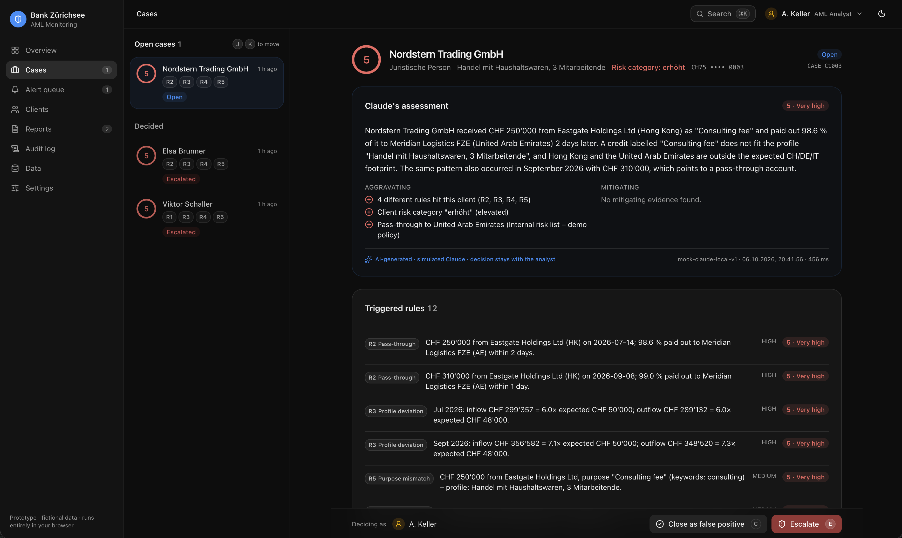

<div align="center">

# AML Suspicious Transaction Monitoring

**Rules raise alerts. AI explains them. A person decides every case.**

A browser-only anti-money-laundering prototype for camt.053 bank statements: it detects
structuring, pass-through and profile deviations, explains every alert in plain language, and walks
an analyst from triage to a four-eyes-approved suspicious activity report.

[](https://github.com/renepardon/AML-Transaction-Monitoring/actions/workflows/ci.yml)
[](https://github.com/renepardon/AML-Transaction-Monitoring/actions/workflows/security.yml)
[](https://github.com/renepardon/AML-Transaction-Monitoring/actions/workflows/container.yml)
[](LICENSE)
<br />
[](#quick-start)
[](tsconfig.app.json)
[](package.json)
[](#run-with-docker-secure-deployment)
[](.github/dependabot.yml)
[](docs/adrs/README.md)



<sub>Case view: Claude's assessment of a CHF 250'000 pass-through, the evidence behind it, and the analyst's decision bar.</sub>

</div>

## What you get

- 🔎 **Deterministic detection:** five rules (structuring, pass-through, profile deviation, risk countries, purpose mismatch) on real camt.053 XML, with thresholds cited from GwV-FINMA and VSB 20.
- 🤖 **Explained alerts:** every alert gets a 2–3 sentence explanation, a 1–5 risk score, and aggravating and mitigating facts. A simulated Claude does this locally, and a real model can be plugged in.
- 🧑‍⚖️ **Human in the loop:** cases sorted by score, close or escalate with a required reason, a streamed MROS-style report draft, and four-eyes approval.
- 🔗 **Tamper-evident audit log:** a SHA-256 hash chain over every step (who or what, when, and why).
- 🔒 **Secure by default:** no backend and no network calls, a strict CSP, and a distroless non-root container with a read-only filesystem. CI covers SAST, DAST, secret and Trivy scans.

> Fictional data. No backend, no database, no external API, no network calls at runtime.
>
> Uploads replace the dataset; they don't add to it. Each upload throws away the current data, including the sample data, and builds a new dataset from the files you drop. To combine your files with the samples, drop them all together (at most 10 files).
>
> Rules for files
>
> - Up to 10 files per upload, 5 MB each. Only .xml and .csv are accepted, and the file type is decided by the extension.
> - XML must be camt.053, versions camt.053.001.02 to .19. A different format or a <!DOCTYPE or <!ENTITY in the file rejects that file.
> - CSV must be a client profile file with exactly these columns: client_id,name,client_type,occupation_or_business,age,risk_category,expected_monthly_inflow_chf,expected_monthly_outflow_chf,expected_countries,iban. risk_category must be normal or erhöht, and IBANs must pass the checksum. Bad rows become warnings, and the rest of the file still loads.
> - Files must be UTF-8.
> - One bad file doesn't stop the others. It shows up as rejected with the reason.
>
> What happens after an upload
>
> - Transactions are linked to clients by IBAN.
> - A statement whose IBAN isn't in any loaded CSV still loads, with an "IBAN has no client profile" warning. But detection needs the profiles, so upload the CSV together with the statements.
> - Duplicate entries are skipped with a warning, and every statement is checked against its opening and closing balances.
> - Then the detection pipeline runs again, and the upload is written to the audit log with a SHA-256 hash of each file.
>
> Uploaded data is lost on a page reload. The dataset isn't stored in the browser; on startup bootstrap() loads the sample data again. Alerts, cases and the audit log are stored, though. So after a reload, cases from your upload sit next to the sample data again. I haven't checked how the app handles that mismatch. If people will use their own files, it's worth either storing the uploaded files or warning about this in the UI.

## Quick start

```bash
npm i
npm run dev        # opens with the sample data already loaded
npm test           # vitest (unit, store, component and acceptance tests)
npm run typecheck
npm run lint
npm run format:check
npm run build
```

Requires Node 22 or newer; Node 24 is recommended (`nvm use` picks it up from `.nvmrc`). CI tests on both 22 and 24, and the container build uses 24 ([ADR-0021](docs/adrs/0021-node-24-baseline.md)).

## Run with Docker (secure deployment)

A multi-stage build that uses only official, freely available images, pinned by digest:

- `node:24-alpine` builds the bundle.
- The official `nginx:1.30.5-alpine-slim` image is cut down to a **self-made distroless root filesystem**: the nginx binary, exactly the shared libraries it links against, `mime.types`, our config and the static files.
- The runtime stage is `FROM scratch`: no shell, no busybox, no package manager. It runs as UID 65532.

```bash
docker build -t aml-poc .

docker run --rm -p 8080:8080 \
  --read-only \
  --tmpfs /tmp:rw,noexec,nosuid,nodev,size=16m \
  --cap-drop=ALL \
  --security-opt=no-new-privileges \
  --user 65532:65532 \
  aml-poc
# open http://localhost:8080
```

- **Read-only root filesystem:** nginx writes only its PID and temp files to the `/tmp` tmpfs. Everything else is root-owned and read-only (`0444`/`0555`).
- **No capabilities, no privilege escalation:** port 8080 needs no `NET_BIND_SERVICE`.
- **Build-time checks:** the build fails if the nginx config is invalid, or if the copied binary cannot resolve its libraries inside the new root filesystem.
- **Static files only:** `GET`/`HEAD` only (anything else → 405), dotfiles → 404, symlinks disabled, request bodies capped at 1 KB.
- **Security headers on every response:** strict CSP (`default-src 'none'`, `script-src 'self'`, `frame-ancestors 'none'` …), HSTS (2 years), `nosniff`, `X-Frame-Options: DENY`, `Referrer-Policy: no-referrer`, a deny-all Permissions-Policy, COOP/COEP/CORP and more. See `docker/security-headers.conf`.
- **Caching:** hashed `/assets/*` are cached as immutable for a year; `index.html` is `no-cache`.
- **Health probe:** `GET /healthz` returns `200 ok`. There is no Docker `HEALTHCHECK`, because the image has no shell or curl; use an HTTP probe in your orchestrator.
- **TLS** is expected to terminate at the ingress or reverse proxy. HSTS only takes effect over HTTPS.

Check the headers:

```bash
curl -sI http://localhost:8080/ | grep -Ei 'content-security|strict-transport|x-frame|permissions|cross-origin'
```

Kubernetes equivalent of the flags above: `runAsNonRoot: true`, `runAsUser: 65532`,
`readOnlyRootFilesystem: true`, `allowPrivilegeEscalation: false`, `capabilities: { drop: [ALL] }`,
`seccompProfile: { type: RuntimeDefault }`, and an `emptyDir` (medium `Memory`) mounted at `/tmp`.

Rationale: [ADR-0019](docs/adrs/0019-secure-container-deployment.md).

## CI/CD and supply-chain security

GitHub Actions run on every push to `main`, on every pull request and weekly. Details: [ADR-0020](docs/adrs/0020-ci-cd-and-supply-chain-security.md).

| Workflow    | What it checks                                                                                                                                                                   |
| ----------- | -------------------------------------------------------------------------------------------------------------------------------------------------------------------------------- |
| `CI`        | On Node 22 and 24: `npm ci --ignore-scripts`, `npm audit signatures`, `npm audit` (any vulnerability fails), formatting, lint, typecheck, tests, build; dependency review on PRs |
| `Security`  | SAST with CodeQL (TypeScript and workflows), TruffleHog secret scan of the full history, Trivy repo scan (dependencies, secrets, Dockerfile)                                     |
| `Container` | Image build, hardening checks (non-root, no shell), hardened run, header smoke test, DAST with the ZAP baseline, Trivy image scan, CycloneDX SBOM                                |

- **Actions** are pinned to full commit SHAs, with the release tag as a comment.
- **Tool images** (Trivy, TruffleHog, ZAP) and **base images** are pinned by tag and digest, in `.github/tool-images/Dockerfile` and the `Dockerfile`.
- **Dependabot** (`.github/dependabot.yml`) opens PRs for npm, GitHub Actions and Docker updates weekly (with a 3-day cooldown), and immediately for security fixes.

Enable these in the repository settings: Dependabot alerts and security updates, secret scanning with push protection, code scanning (private repos need GitHub Advanced Security), "require actions pinned to full-length commit SHA", and branch protection on `main` requiring the three workflows.

## Two-minute demo script

1. **Overview**: 6 accounts, 193 transactions, 3 open cases, the 8-stage pipeline strip and "Data integrity OK".
2. **Cases**: open the top case (e.g. _Nordstern Trading GmbH_). Read Claude's assessment aloud: the
   CHF 250'000 "consulting fee" from Hong Kong, 98.6 % paid out to the UAE two days later, repeated in
   September.
3. Press **E** (or _Escalate_), give a reason (≥ 10 characters) and confirm. Then click _View report_ in the toast.
4. **Reports**: the draft streams in live (queued → generating → draft). Click _Submit for review_.
5. Try _Approve_ as A. Keller. This is blocked by the **four-eyes** rule. Switch to **M. Rossi** in the
   top bar and approve with a reason.
6. **Audit log**: every step with time, actor (system / AI / analyst) and reason, and the "Chain verified" badge.
7. **Alert queue**: _Sara Huber_ (score 1, "close suggested"). Click _Dismiss_, give the reason
   (car purchase with contract, bonus received the week before), and the false positive is closed with a reason.

Keyboard: `⌘K` command palette, `J`/`K` move through cases, `E` escalate, `C` close.

## What the pipeline finds on the bundled files

| Client                       | Pattern                                                                            | Rules                    | Score | Outcome                                |
| ---------------------------- | ---------------------------------------------------------------------------------- | ------------------------ | ----- | -------------------------------------- |
| C1002 Viktor Schaller        | 9 cash deposits CHF 14'200–14'900 in Aug; CHF 120'000 "Übertrag" to own name in LI | R1 (high), R3, R4, R5    | 5     | Case                                   |
| C1003 Nordstern Trading GmbH | HK → AE pass-through twice (CHF 250'000 / 310'000)                                 | R2 (high ×2), R3, R4, R5 | 5     | Case                                   |
| C1001 Elsa Brunner           | CHF 180'000 "Loan" from GB, out to a crypto exchange in EE                         | R2, R3, R4, R5           | 5     | Case                                   |
| C1006 Sara Huber             | CHF 38'000 car purchase with contract, after a CHF 18'500 bonus                    | R3 only                  | 1     | Triage queue → close as false positive |
| C1005 Bäckerei Moser AG      | Weekly cash takings CHF 3'600–5'100                                                | –                        | –     | No alert                               |
| C1004 Lukas Frei             | Salary and normal spending                                                         | –                        | –     | No alert                               |

`src/services/pipeline.acceptance.test.ts` asserts this table.

## Detection rules (`src/domain/rules`)

All rules are pure functions `(ctx) => RuleHit[]`. Thresholds live in `useRuleConfigStore` and can be tuned on the
Settings page; no client ids or names are hard-coded.

| Rule                 | Logic (defaults)                                                                                                                        |
| -------------------- | --------------------------------------------------------------------------------------------------------------------------------------- |
| R1 Structuring       | ≥ 3 cash deposits (`PMNT/CNTR/CDPT`) of CHF 12'000–14'999.99 in any rolling 30 days. High if ≥ 5 or the sum is > 3× the threshold.      |
| R2 Pass-through      | Credit ≥ max(CHF 50'000, 2× expected inflow), followed within 10 days by debits ≥ 80 % of it. High if ≥ 95 % or ≤ 3 days.               |
| R3 Profile deviation | Monthly inflow or outflow > 3× expected and ≥ CHF 10'000 above it. High if > 6×.                                                        |
| R4 Risk country      | Counterparty in a FATF-listed (high) or internally elevated (medium) country, or outside the expected countries from CHF 10'000.        |
| R5 Purpose mismatch  | ≥ CHF 10'000 with keywords (consulting, advisory, loan, crypto, exchange, übertrag, deposit account) or an own-account transfer abroad. |
| R0 Data integrity    | Balance reconciliation (OPBD + Σ entries = CLBD, month-to-month continuity) and duplicate `AcctSvcrRef`. Data warnings, not AML alerts. |

### Thresholds and legal basis (`src/domain/reference/thresholds.ts`)

| Constant                   | Value      | Basis                                                                                         |
| -------------------------- | ---------- | --------------------------------------------------------------------------------------------- |
| Cash identification        | CHF 15'000 | GwV-FINMA Art. 51 para. 1 lit. b (incl. connected transactions); VSB 20 aligned to CHF 15'000 |
| Money exchange             | CHF 5'000  | GwV-FINMA Art. 51 para. 1 lit. a (reference only)                                             |
| Money transfer from abroad | CHF 1'000  | GwV-FINMA Art. 52 para. 2; outbound abroad: identify always (para. 1)                         |
| Structuring band           | 80 %       | Bank policy: "just below" = CHF 12'000–14'999.99                                              |

VSB 20 requires identification when amounts are visibly split ("smurfing"), and Art. 51 para. 3 requires it in every case with signs of money
laundering. Account holders are identified at onboarding, so on an account these thresholds act as **avoidance signals**.
Art. 52 applies to the money transfer business, not to account transfers.

### Country lists (`src/domain/reference/countryRisk.ts`, as of the June 2026 FATF plenary)

- FATF call for action: KP, IR, MM
- FATF increased monitoring (22): AO, BO, BA, BG, CM, CI, CD, HT, IQ, KE, KW, LA, LB, MC, NP, PG, SS, SY, VE, VN, VG, YE
- **Internal risk list – demo policy (not FATF)**: AE, HK, CY, PA, KY, SC, BS, BZ, MT, LI, EE

None of the counterparty countries in the data (HK, AE, EE, GB, LI) is FATF-listed. The lists must be updated after
every FATF plenary.

## The simulated AI and its limits

`MockClaudeProvider` (`src/domain/triage`) is **local and deterministic**. It does not call any model:

- Score = clamp(1..5) of: severity base (low 1, medium 2, high 3), +1 if ≥ 3 distinct rules hit the client,
  +1 if the risk category is elevated or the deviation is > 10×, +1 for a pass-through to a risk-tier country,
  −1/−2 for mitigating evidence (salary payer, Lohn/Bonus/Salär, domestic contract reference, one-off amount
  below six monthly incomes, all countries expected). Supporting facts only count together with a strong one.
- Explanations come from sentence templates filled with real amounts, dates, counterparties and profile facts,
  and a tested guard enforces 2–3 sentences.
- Follow-up questions are answered by keyword intent (countries, timeline, profile, why score, similar cases).
- Report drafts are built from an MROS-like template (Art. 9 GwG) and streamed chunk by chunk.

The output is always labelled "AI-generated · simulated Claude · decision stays with the analyst". It cannot
reason beyond its templates, and it can miss context that a real model or a human would notice.

### Plugging in a real model

The UI depends only on two interfaces:

- `TriageProvider` (`src/domain/triage/TriageProvider.ts`): `triage(input) → Promise<TriageResult>`
- `ReportDrafter` (`src/domain/reports/ReportDrafter.ts`): `draft(input) → AsyncIterable<ReportChunk>`

Implement them, for example with the Anthropic Messages API through your own backend proxy (never ship an API key to the
browser), and register them with `setTriageProvider()` (`src/services/triageProvider.ts`) and `setReportDrafter()`
(`src/services/reporting.ts`) behind a feature flag. The CSP `connect-src 'self'` then needs to allow your proxy.

## Architecture

```
src/domain     pure TypeScript: parsing, rules, triage, cases, reports, audit hash chain
src/services   orchestration and the only cross-store writers (pipeline, ingest, decisions, reporting, audit, settings, session)
src/stores     one Zustand store per concern + selectors; no store imports another store
src/components atoms / molecules (pure) → organisms (read selectors, call services) → templates
src/pages      compose templates and organisms only
```

Stores: `useDataStore` (not persisted; rebuilt from sources), `useRuleConfigStore`, `useAlertStore`, `useCaseStore`,
`useReportStore` (separate, drives the visible drafting lifecycle), `useAuditStore` (append-only), `useSessionStore`,
`useUiStore` (navigation, dialogs, form drafts). Persisted under the `aml-poc:` prefix with `version` + `migrate`.

## Safety measures

- 5 MB per file, ≤ 10 files, `.xml`/`.csv` only; strict UTF-8 decoding, BOM stripped.
- XML with `<!DOCTYPE` or `<!ENTITY` is rejected before parsing (XXE / entity expansion).
- Namespace check (`camt.053.001.02`–`19`), namespace-aware reads only, zod validation, IBAN mod-97, ISO 4217/3166.
- Money as integer Rappen, never `parseFloat`.
- De-duplication by IBAN + `AcctSvcrRef`, balance reconciliation, warnings instead of crashes.
- No `dangerouslySetInnerHTML` in application code (lint rule). CSV exports neutralise `= + - @`.
- Strict CSP meta tag. SHA-256 of every source in the "data loaded" audit entry.
- Audit hash chain: `hash = SHA-256(prevHash + canonicalJSON(entry))`, verified on the Audit page. "Reset demo"
  writes a final entry and anchors the new chain on its hash.

## Architecture decisions

All decisions are recorded as ADRs in [`docs/adrs/`](docs/adrs/README.md).

## Known deviations from the implementation plan

- **Sara Huber scores 1, not 2.** The plan's table says 2, but its own formula (medium base 2 minus mitigation) can only
  produce 1 once any mitigation applies. The acceptance test requires ≤ 2; the outcome (triage queue, close as false positive) is unchanged.
- The generated shadcn `chart` component injects its CSS variables via `dangerouslySetInnerHTML` (static config only).
  It is generated code under `components/ui` and was not edited.
- shadcn's `sonner` wrapper pulls in `next-themes`; the theme is still driven by `useUiStore` and passed to the toaster as a prop.
- The optional Anthropic adapters were not added; see "Plugging in a real model".

## Contributing

Issues and pull requests are welcome. See [CONTRIBUTING.md](CONTRIBUTING.md) for setup, conventions and the checks a PR has to pass. Everyone taking part is expected to follow the [Code of Conduct](CODE_OF_CONDUCT.md).

## Security

Please report vulnerabilities privately as described in [SECURITY.md](SECURITY.md), not in public issues.

## License

[MIT](LICENSE). The bundled sample data is fictional. This project is a prototype and not a certified AML system; decisions always stay with qualified people.
